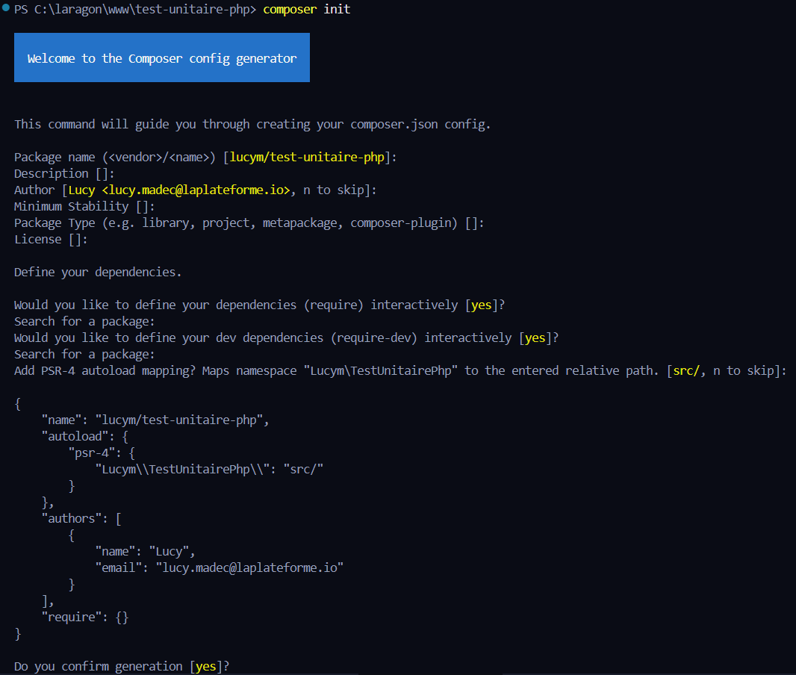
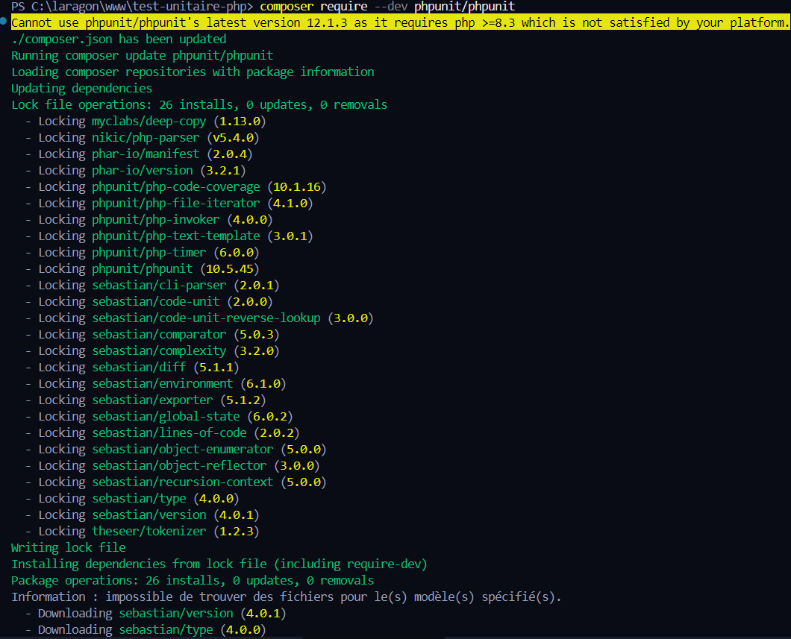
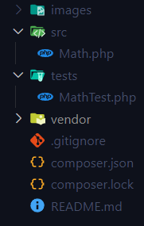
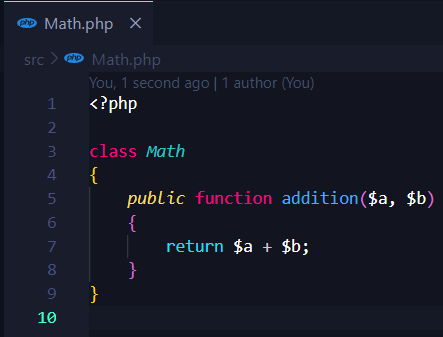
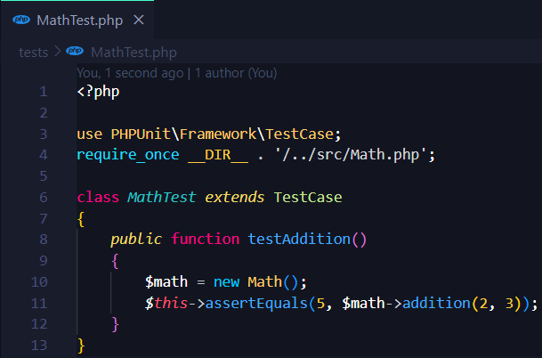
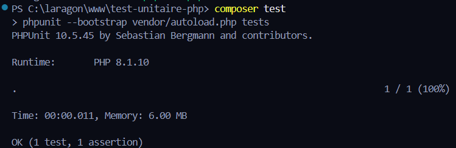
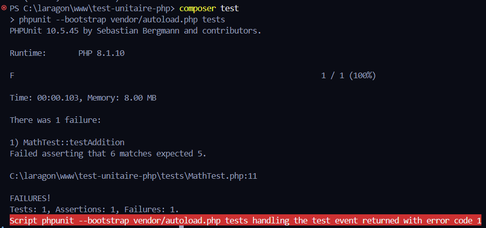

# Test Unitaire PHP - Découverte de PHPUnit

## 📚 Objectif
Créer un projet PHP avec Composer et PHPUnit pour découvrir les tests unitaires, écrire une fonction simple, tester son fonctionnement, et documenter chaque étape.

---

## 🔹 Etape 1 - Initialisation du projet

**Commande exécutée :**
```bash
mkdir test-unitaire-php && cd test-unitaire-php
composer init
```

**Capture d’écran :**


**Explication :**
Initialisation d’un projet PHP avec Composer. On accepte les valeurs par défaut pour les questions posées.

---

## 🔹 Etape 2 - Installation de PHPUnit

**Commande exécutée :**
```bash
composer require --dev phpunit/phpunit
```

**Capture d’écran :**


**Explication :**
Installation de PHPUnit en tant que dépendance de développement. Cela nous permet d'utiliser la commande `vendor/bin/phpunit` pour lancer les tests.

---

## 🔹 Etape 3 - Structure du projet

**Arborescence :**
```
test-unitaire-php/
├── src/
│   └── Math.php
├── tests/
│   └── MathTest.php
├── images/
├── vendor/
├── composer.json
└── README.md
```

**Commande exécutée :**
```bash
mkdir src tests images
```

**Capture d’écran :**


**Explication :**
Organisation standard d’un projet PHP testé avec PHPUnit.

---

## 🔹 Etape 4 - Création de la classe Math

**Fichier :** `src/Math.php`

```php
<?php

class Math
{
    public function addition($a, $b)
    {
        return $a + $b;
    }
}
```

**Capture d’écran :**


**Explication :**
Une méthode `addition` basique qui additionne deux nombres. C’est notre fonction à tester.

---

## 🔹 Etape 5 - Test unitaire avec PHPUnit

**Fichier :** `tests/MathTest.php`

```php
<?php

use PHPUnit\Framework\TestCase;
require_once __DIR__ . '/../src/Math.php';

class MathTest extends TestCase
{
    public function testAddition()
    {
        $math = new Math();
        $this->assertEquals(5, $math->addition(2, 3));
    }
}
```

**Capture d’écran :**


**Explication :**
Test simple qui vérifie que la méthode `addition(2, 3)` renvoie bien 5.

---

## 🔹 Etape 6 - Lancer les tests

**Commande exécutée :**
```bash
./vendor/bin/phpunit --bootstrap vendor/autoload.php tests
```

**Ou via Composer script :**
```json
"scripts": {
  "test": "phpunit --bootstrap vendor/autoload.php tests"
}
```
Puis :
```bash
composer test
```

**Capture d’écran :**


**Explication :**
Exécution du test, le résultat est positif : tout fonctionne.

---

## 🔹 Etape 7 - Simulation d’erreur

**Modification temporaire :**
```php
return $a * $b; // au lieu de $a + $b
```

**Capture d’écran de l’erreur :**


**Explication :**
On provoque une erreur pour vérifier le bon comportement du test. Une fois testé, on corrige la méthode.

---

## 📅 Commits et GitHub

**Bonnes pratiques :**
- Des **commits réguliers** avec des **messages explicites** (ex : `ajout de la classe Math`, `ajout du test addition`)
- Nom du repo GitHub : `test-unitaire-php`
- Partage avec votre formateur

---

## 👍 Compétences développées
- Maîtrise de Composer et PHPUnit
- Ecriture de tests unitaires simples
- Bonne structuration de projet PHP
- Utilisation de GitHub avec README documenté

---

> Rendu : **README.md + images** bien organisées dans le repo GitHub `test-unitaire-php`